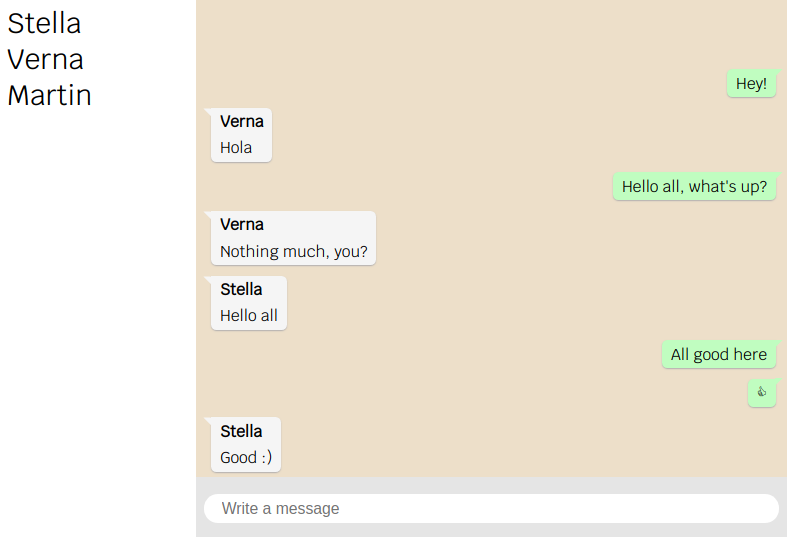

# WhatsApp Chat Clone

This is an application based off of Flavio Copes' [chat tutorial](https://github.com/flaviocopes/chat-app-react-redux-saga-websockets) which was subsequently modified to make it look more like a WhatsApp clone.
You can open multiple windows to simulate different users interacting with each other. The server will take care of managing the users' connections and will deliver all the messages to the rest of the chat room in real time through web sockets.
This little project is meant to be an exercise in using React, Redux, Redux-Saga and web sockets.

#### Installation

First install the npm packages you need through the `npm install` command, then use the dedicated script `npm run run-app` to launch the app.
